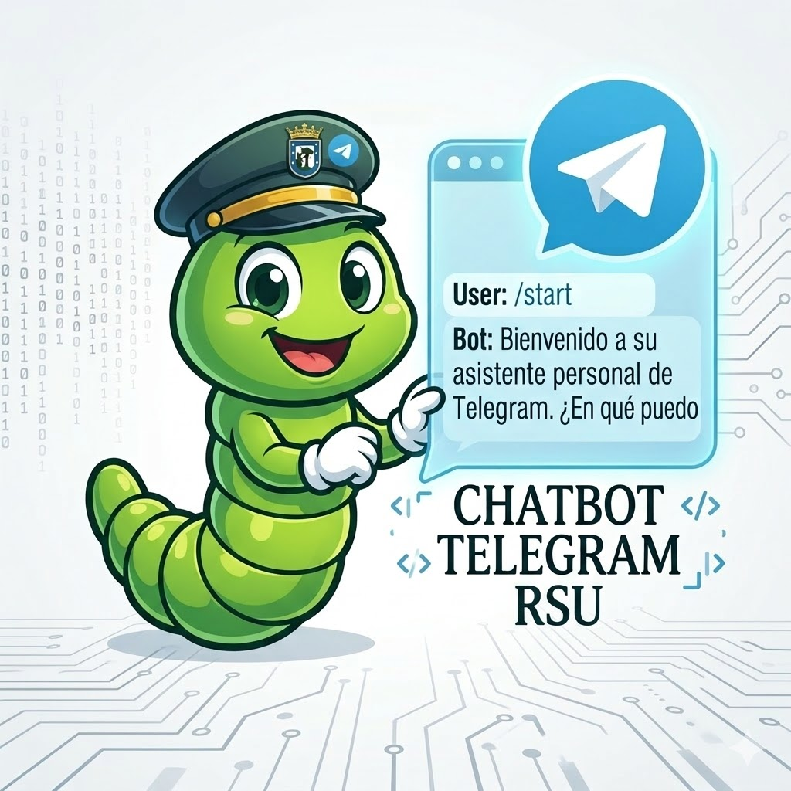

<p align="left">
  
</p>


## 🧠 Features

Chatbot que genera informacion para los operarios de rsu madrid

- 📩 Recepción y manejo de mensajes en tiempo real
- ⚡ Sistema de eventos desacoplado
- 🔌 Fácil integración con servicios externos
- 🧩 Arquitectura extensible
- 🔁 Manejo de errores y reconexión

## 🔄 Flujo de funcionamiento

- Telegram envía un evento (mensaje, comando, etc.)

- El provider lo captura

- Se redirige al handler correspondiente

- El bot responde al usuario

## 📦 Instalación

```bash
git clone https://github.com/Vempar/chatbot_telegram.git
cd chatbot_telegram
npm install
```
## 🤝 Contribuciones

Las contribuciones son bienvenidas.

- Haz un fork del proyecto

- Crea una nueva rama (feature/nueva-feature)

- Haz commit de tus cambios

- Abre un Pull Request

## 🙌 Autor

Desarrollado por Vempar
